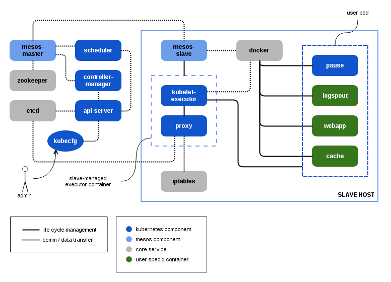

## Kubernetes-Mesos Documentation

This project combines concepts and technologies from two already-complex projects: Mesos and Kubernetes.
It may help to familiarize yourself with the basics of each project before reading on:

* [Mesos Documentation][1]
* [Kubernetes Documentation][2] and [Key Concepts][4]
  * [Labels][6]
  * [Nodes][9]
  * [Pods][7]
  * [Replication Controller][8]
  * [Services][5]

It may also be helpful to understand the [known issues][3] with respect to this project.

### Architecture

A Mesos cluster consists of one or more masters, and one or more slaves.
Kubernetes-Mesos (k8sm) operates as a Mesos framework that runs on the cluster.
As a framework, k8sm provides scheduler and executor components, both of which are hybrids of Kubernetes and Mesos:
the scheduler component integrates the Kubernetes scheduling API and the Mesos scheduler runtime, whereas;
the executor component integrates Kubernetes kubelet services and the Mesos executor runtime.

Multiple Mesos masters are typically configured to coordinate leadership election via Zookeeper.
Kubernetes maintains its internal registry (pods, replication controllers, bindings, minions, services) in etcd.
Users typically interact with Kubernetes using the `kubecfg` or `kubectl` commands to manage Kubernetes primitives.

When a pod is created in Kubernetes, the k8sm scheduler creates an associated Task and queues it for scheduling.
Upon pairing the task with an acceptable resource offer, the scheduler binds the task to the offer's slave.
As a result of binding the task is launched and delivered to an executor (an executor is created by the Mesos slave if one is not already running).
The executor launches the task, which registers the bound pod with the kubelet engine and the kubelet begins to manage the lifecycle of the pod instance.

[1]: http://mesos.apache.org/documentation/latest
[2]: https://github.com/GoogleCloudPlatform/kubernetes/blob/master/docs/README.md
[3]: issues.md
[4]: https://github.com/GoogleCloudPlatform/kubernetes/blob/master/DESIGN.md#key-concepts
[5]: https://github.com/GoogleCloudPlatform/kubernetes/blob/master/docs/services.md
[6]: https://github.com/GoogleCloudPlatform/kubernetes/blob/master/docs/labels.md
[7]: https://github.com/GoogleCloudPlatform/kubernetes/blob/master/docs/pods.md
[8]: https://github.com/GoogleCloudPlatform/kubernetes/blob/master/docs/replication-controller.md
[9]: https://github.com/GoogleCloudPlatform/kubernetes/blob/master/docs/node.md
